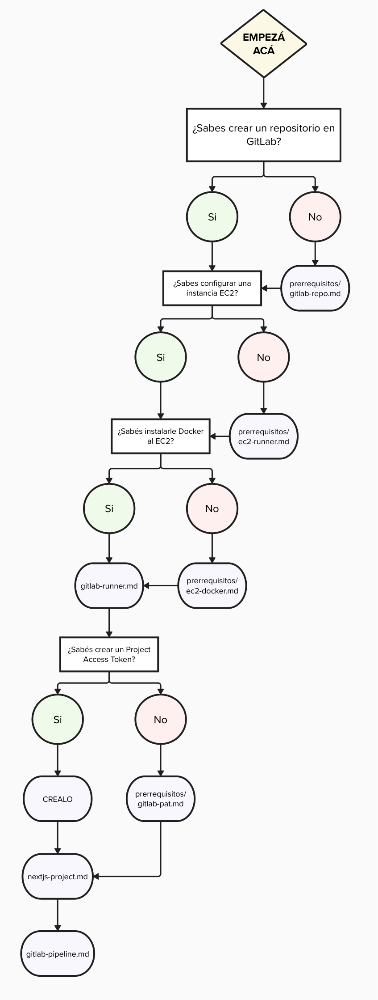

# Configuración GitLab CI/CD

Este repositorio contiene una serie de guías para configurar correctamente un pipeline de CI/CD en la plataforma de [GitLab](https://gitlab.com/), haciendo uso de dos instancias [EC2](https://aws.amazon.com/es/ec2/). Una de las instancias será la encargada de correr el pipeline, y la otra actuará como servidor de producción.
Dado que el campo de CI/CD es muy amplio, optamos por poner una configuración a modo de ejemplo con una aplicación de [Next.js](https://nextjs.org/) muy simple para familiarizarnos con los conceptos más importantes.

## Estructura del proyecto

Las carpetas que pueden encontrarse en el proyecto son:

- `img`: Contiene las imágenes que se utilizan en las guías.
- `guias`: Contiene las guías per se.
  - `prerrequisitos`: Algunas de las guías tienen prerrequisitos, si no se sabe cómo llevarlos a cabo se incluyeron guías para esto también.

## ¿Por dónde empiezo?

Armamos un árbol de decisiones para que sea más fácil seguir las guías.

   

En violeta se muestra el archivo al que se debe acceder (se encuentra dentro de `guias/`) para ese punto de la guía.

## Integrantes

Este proyecto fue realizado como TP especial para la materia _72.20 - Redes de la Información_ (2024 1C) por el equipo conformado por:

- Nicolás Margenat (n° 62028)
- Juan Burda (n° 62094)
- Elian Paredes (n° 62493)
- Saul Castañeda (n° 62504)
