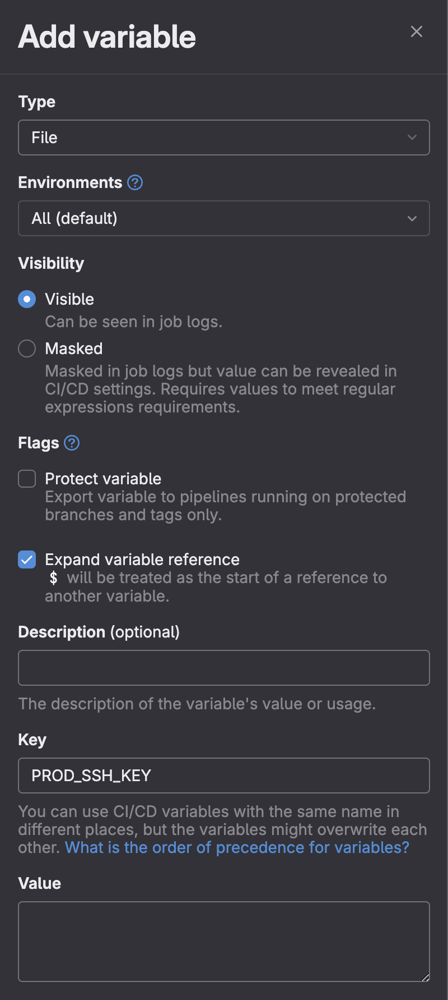
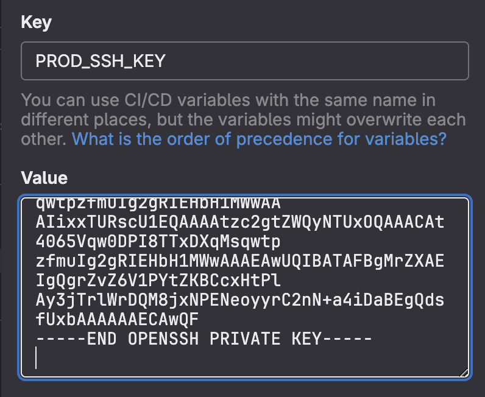

# Creación de un pipeline en GitLab

A grandes rasgos, el proceso de despliegue denota los siguientes pasos:

1. Se realiza una operación de `git push` al repositorio, promoviendo una nueva versión del software
2. El pipeline del `runner` es ejecutado, realizando pruebas unitarias (u otros procesos) y a la empaquetación de una imagen de `Docker` correspondiente a la nueva versión del software como un servicio listo para desplegar
3. Esta imagen es subida a un registro privado de [GitLab Container Registry](https://docs.gitlab.com/ee/user/packages/container_registry/)
4. Se le envía a la instancia de producción la imagen generada y esta se levanta como servicio, concretando el despliegue y exponiendo la nueva versión del software al público.

Comenzaremos dando de alta un registro de contenedores dentro de nuestro repositorio con GitLab Container Registry.

> <u>Prerrequisitos</u>:
>
> -   Configurar Project Access Token en el repositorio ([link](./prerrequisitos/gitlab-pat.md))
> -   Tener un proyecto de Next.js en el repositorio ([link](nextjs-project.md))

## 1. Creación de la instancia de producción

Deberemos crear otra instancia EC2 además de la del Runner, para que actúe como nuestro servidor de producción. Si seguiste [esta guía](./prerrequisitos/ec2-runner.md), podes volver a verla pero cambiando las siguientes variables:

-   Cambiar el nombre a `prod` en lugar de `runner`
-   Así también generar otro par de claves SSH, la cual denominaremos `prod_key` generando así el archivo `prod_key.pem`
-   También configuraremos un grupo de seguridad adecuado para poder acceder al contenido de forma pública

Luego de crear la instancia, siguiendo con lo explicado en secciones anteriores, nos conectamos mediante SSH e instalamos por el momento solo _Docker_ (si no recordás cómo hacerlo mirá [esta guía](./prerrequisitos/ec2-docker.md)).

## 2. Configuración de acceso a EC2 de producción

Tal como se nombró previamente, debemos tener una forma de comunicación entre la instancia del `runner` y la instancia de producción `prod`. Hemos generado otra clave privada denominada`prod_key`, la cual vamos a utilizar ahora para generar el acceso a la instancia de `prod` desde el `runner`.

Sin embargo, en lugar de utilizar el archivo `.pem` para acceder a la instancia de producción, haremos uso de las variables de entorno CI/CD que nos ofrece GitLab. Vamos a seguir una de las practicas que exponen en su documentación sobre [cómo utilizar claves SSH dentro de un pipeline de CI/CD](<https://docs.gitlab.com/ee/ci/ssh_keys/#:~:text=To%20create%20and%20use%20an,a%20newline%20(%20LF%20character).>).

1. En el menú de la izquierda de la pantalla principal de nuetro repositorio, clickeamos "Settings" > "CI/CD".
2. A diferencia de los pasos anteriores elegiremos como "Type" una variable de tipo `File`. Elegimos una "Key" para la variable. Esta "Key" será la forma en la cual nos referiremos a la misma dentro de la definición del Pipeline, en nuestro caso `PROD_SSH_KEY`

 

3. A continuación debemos colocar el valor que contendrá esta clave. Para esto copiaremos el contenido del archivo `prod_key.pem` que descargamos previamente desde AWS y lo pegaremos como valor de esta variable `PROD_SSH_KEY`.
   

> [!IMPORTANT]
> Tal como indica la documentación de GitLab, es importante dejar una nueva línea al final del contenido colocado en el campo de "Value".

4. Clickeamos en "Add variable" y la variable será creada. El valor de la variable sólo puede ser visto por los dueños del repositorio (aunque esto puede configurarse).

## 3. Dockerizando la App de Next.js

Ya teniendo los accesos a las instancias preparados, podemos pasar a la creación del pipeline de despliegue. Pero primero también hará falta definir un `Dockerfile` que describa cómo se debe empaquetar la aplicación de Next.js.

Dentro de la carpeta raíz del proyecto, crearemos un archivo Dockerfile , con el siguiente contenido:

```docker
# Usar la imagen oficial de Node.js como imagen base
FROM node:22-alpine3.18

# Establecer el directorio de trabajo en el contenedor
WORKDIR /usr/src/app

# Copiar package.json y package-lock.json al directorio de trabajo
COPY package*.json ./

# Instalar dependencias
RUN npm install

# Copiar el resto del código de la aplicación al directorio de trabajo
COPY . .

EXPOSE 3000

# Ejecutar el comando para iniciar la aplicación
CMD ["npm", "run", "dev"]
```

Una vez listo el archivo `Dockerfile`, lo subimos al repositorio y el mismo será consumido durante el pipeline en la etapa correspondiente.

## 4. Creando un pipeline de despliegue

Los pipelines en GitLab deben configurarse en un archivo `gitlab-ci.yml` en el directorio raíz de nuestro proyecto.

Un pipeline ejecuta una serie de stages, y dentro de cada stage podemos tener uno o más jobs. Los stages que se suelen tener son:

-   Preparation: Involucra la preparación del ambiente de trabajo. Aquí definimos las versiones del software, obtenemos artefactos de otros repositorios, etc.
-   Build: Aquí definimos y generamos los artefactos utilizados en el resto de etapas. Podemos generar artefactos específicos para testing y otros específicos para producción.
-   Testing: Acá testeamos los artefactos que armamos en la etapa anterior.
-   Deploy: Ponemos el código en un ambiente productivo.

```yaml
stages:
    - prep
    - build
    - test
    - deploy
```

### 4.1. Stage: Prep

Para el stage de _prep_ vamos a tener un único job que llamaremos "preparation", en el que vamos a querer generar un ID de nuestra build para que en un futuro podamos identificar las imágenes que estén pusheadas en el registry de containers.

```yaml
preparation:
    stage: prep
    script:
        - export BUILD_ID=$(date +%Y%m%d%H%M) # Generamos un id para la build
        - echo "BUILD_ID=${BUILD_ID}" > context.env # Lo guardamos en context.env
```

Notemos que estamos generando un archivo `context.env` que usaremos como artifact para poder pasar nuestras variables de entorno por los distintos jobs, por lo tanto tenemos que declararlo como tal.

```yaml
preparation:
  stage: prep
  script:
    - export BUILD_ID=$(date +%Y%m%d%H%M) # Generamos un id para la build
    - echo "BUILD_ID=${BUILD_ID}" > context.env # Lo guardamos en context.env
   artifacts:
      paths:
         - context.env
```

Además, queremos generar un nombre para la imagen de nuestra webapp. En este punto, es importante notar que como la vamos a pushear a GitLab debemos concatenarle el path absoluto a nuestro repositorio en esta plataforma. Para ellos, vamos a hacer uso de las [variables de CI/CD predefinidas en GitLab](https://docs.gitlab.com/ee/ci/variables/predefined_variables.html). Entonces, al comienzo del archivo `gitlab-ci.yml` agregamos lo siguiente:

```yaml
variables:
    IMAGE_BASE: "$CI_REGISTRY/$CI_PROJECT_NAMESPACE/$CI_PROJECT_NAME"
```

y dentro de el job de preparation ponemos:

```yaml
preparation:
    stage: prep
    script:
        - export BUILD_ID=$(date +%Y%m%d%H%M) # Generamos un id para la build
        - echo "BUILD_ID=${BUILD_ID}" > context.env # Lo guardamos en context.env

        - echo "APP_PROD_IMAGE_NAME=${IMAGE_BASE}/app:prod-${BUILD_ID}" >> context.env # Concatenamos a context.env el nombre de nuestra imagen de producción
```

Falta entonces poner la imagen default que se utilizará para ejecutar estos jobs. Para ello, vamos a agregar al tope del archivo lo siguiente:

```yml
image: docker:latest
```

Por lo tanto, al finalizar este punto deberíamos tener el `gitlab-ci.yml` como sigue:

```yaml
image: docker:latest

variables:
    IMAGE_BASE: "$CI_REGISTRY/$CI_PROJECT_NAMESPACE/$CI_PROJECT_NAME"

stages:
    - prep
    - build
    - test
    - deploy

preparation:
    stage: prep
    script:
        - export BUILD_ID=$(date +%Y%m%d%H%M) # Generamos un id para la build
        - echo "BUILD_ID=${BUILD_ID}" > context.env # Lo guardamos en context.env

        - echo "APP_PROD_IMAGE_NAME=${IMAGE_BASE}/app:prod-${BUILD_ID}" >> context.env # Concatenamos a context.env el nombre de nuestra imagen de producción
    artifacts:
    paths:
        - context.env
```

### 4.2. Stage: Build

El stage de _build_ tendrá un único job "build". Este job trae consigo un inconveniente: la seguridad. La manera fácil de realizar el build de una imagen de Docker dentro de un container es otorgándole a este último privilegios de root, pero esto es poco seguro. Por ello vamos a optar por utilizar [Kaniko](https://github.com/GoogleContainerTools/kaniko), una imagen que hace el build de los contenedores sin necesitar los privilegios de _sudo_.

```yaml
build:
    stage: build
    image:
        name: "gcr.io/kaniko-project/executor:v1.14.0-debug"
        entrypoint: [""]
```

Notemos que debemos poner `entrypoint: [""]` porque de lo contrario vamos a ejecutar un comando que no queremos.

Hecho esto, vamos a querer utilizar Kaniko para _buildear_ y _pushear_ la imagen al registry de GitLab. Afortunadamente, Kaniko hace esto en un sólo paso, por lo que agregamos lo siguiente.

```yaml
build:
  stage: build
  image:
    name: "gcr.io/kaniko-project/executor:v1.14.0-debug"
    entrypoint: [""]
  script:
    - /kaniko/executor
      --context "${CI_PROJECT_DIR}" # Dónde esta el contexto para buildear la imagen
      --dockerfile ${CI_PROJECT_DIR}/Dockerfile # Dirección del Dockerfile que creamos en el paso #3
      --destination $APP_PROD_IMAGE_NAME  # A dónde dejamos la imagen de producción,
                                          # notemos que la dirección está en el mismo nombre de la imagen (${IMAGE_BASE}/<nombre>)
```

Lo último que debemos hacer es obtener el artifact generado en el paso anterior, por lo que el yaml nos queda como sigue:

```yaml
build:
   stage: build
   image:
      name: "gcr.io/kaniko-project/executor:v1.14.0-debug"
      entrypoint: [""]
   script:
      - export $(cat context.env | xargs)

      - /kaniko/executor
         --context "${CI_PROJECT_DIR}" # Dónde esta el contexto para buildear la imagen
         --dockerfile ${CI_PROJECT_DIR}/Dockerfile # Dirección del Dockerfile que creamos en el paso #3
         --destination $APP_PROD_IMAGE_NAME  # A dónde dejamos la imagen de producción,
                                             # notemos que la dirección está en el mismo nombre de la imagen (${IMAGE_BASE}/<nombre>)
   needs:
      -  job: preparation
         artifacts: true
```

### 4.3. Stage: Test

El stage de _test_ contendrá dos jobs: "unit-test" y "uxui-test".

#### Job: Unit-test

Este job se encargará (como dice su nombre) de realizar los tests unitarios de nuestro código. Para ello utilizaremos el framework de testing [Jest](https://jestjs.io/). La siguiente configuración de ejemplo está fuertemente inspirada en la que se puede encontrar en el siguiente [link](https://nextjs.org/docs/app/building-your-application/testing/jest).

1. Hacemos el set up de Jest _en nuestro proyecto_ (NO en el pipeline), para ello tenemos que instalarlo junto con unos paquetes como dependencias de dev. Esto debe ejecutarse desde el directorio raíz de nuestro proyecto de Next:

    ```bash
    npm install -D jest jest-environment-jsdom @testing-library/react @testing-library/jest-dom
    ```

2. En el directorio raíz de nuestro proyecto de Next debemos crear el archivo `jest.config.js` con el siguiente contenido:

    ```javascript
    const nextJest = require("next/jest");

    /** @type {import('jest').Config} */
    const createJestConfig = nextJest({
        // Provide the path to your Next.js app to load next.config.js and .env files in your test environment
        dir: "./",
    });

    // Add any custom config to be passed to Jest
    const config = {
        coverageProvider: "v8",
        testEnvironment: "jsdom",
        // Add more setup options before each test is run
        // setupFilesAfterEnv: ['<rootDir>/jest.setup.ts'],
    };

    // createJestConfig is exported this way to ensure that next/jest can load the Next.js config which is async
    module.exports = createJestConfig(config);
    ```

Este archivo configura Jest para que pueda trabajar correctamente con nuestra aplicación de Next.

3. En el `package.json` agregamos el comando `"test": "jest"` dentor de `"scripts"`.

4. En el pipeline, vamos a agregar el job de "unit-test" con el siguiente contenido:

    ```yaml
    job: unit-test
        stage: test
        image: node:22-alpine3.18
        scripts:
            - npm install
            - npm run test
    ```

# FALTA PONER LOS TESTS UNITARIOS

#### Job: Uxui-test

Este job se encargará de realizar los tests de usabilidad. Para ello utilizaremos el framework de testing [Cypress](https://www.cypress.io/). La siguiente configuración está fuertemente inspirada en el tutorial del siguiente [link](https://nextjs.org/docs/pages/building-your-application/testing/cypress).

1. En la carpeta raíz del proyecto ejecutamos el siguiente comando:

    ```bash
    npm install -D cypress
    ```

2. En el archivo `package.json`, dentro de la sección de `"scripts"` agregamos el siguiente comando: `"cypress:open": "cypress open"`.

3. Parados en la carpeta raíz de nuestro proyecto, corremos el comando `npm run cypress:open`. Esto nos dará a elegir entre **E2E Testing** y **Component Testing**. Nosotros elegiremos hacer **E2E Testing**.
   Esto nos creará un archivo `cypress.config.ts` y una carpeta `cypress/`. Chequear que el contenido de `cypress.config.ts` sea el siguiente:

    ```typescript
    import { defineConfig } from "cypress";

    export default defineConfig({
        e2e: {
            setupNodeEvents(on, config) {},
        },
    });
    ```

4. Desde la carpeta raíz de nuestro proyecto, corremos `npm install start-server-and-test`. Una vez instalado el paquete, agregamos al `package.json` dentro de la sección de `"scripts"` el siguiente comando: `"test": "start-server-and-test start http://localhost:3000 cypress"`.

5. Para poder correr los tests en el pipeline debemos hacerlo en modo headless. Para ello, en el `package.json` dentro de la sección de `"scripts"` agregamos el siguiente comando: `"e2e:headless": "start-server-and-test dev http://localhost:3000 \"cypress run --e2e\""`.

6. En el `gitlab-ci.yml`, agregamos el job de uxui con el siguiente contenido:

```yaml
uxui-test:
    stage: test
    image:
        name: "cypress/included:13.9.0"
        entrypoint: [""]
    script:
        - npm ci
        - npm run e2e:headless
```

Con esto habremos configurado correctamente los tests de usabilidad, ahora solo resta armarlos. Para ello haremos dos testeos muy simples.

1. Agregar/Modificar el archivo `src/app/page.tsx`:

    ```tsx
    import Link from "next/link";

    export default function Home() {
        return (
            <div>
                <h1 className="m-2 font-bold text-xl">Home</h1>
                <Link
                    className="mx-2 my-4 text-neutral-400 hover:text-white duration-300"
                    href="/about"
                >
                    About
                </Link>
            </div>
        );
    }
    ```

2. Agregar el archivo `src/app/about/page.tsx`:

    ```tsx
    import Link from "next/link";

    const About = () => {
        return (
            <div>
                <h1 className="m-2 font-bold text-xl">About</h1>
                <Link
                    className="mx-2 my-4 text-neutral-400 hover:text-white duration-300"
                    href="/"
                >
                    Home
                </Link>
            </div>
        );
    };

    export default About;
    ```

3. Agregamos un test para asegurarnos que la navegación esté funcionando correctamente. Para ello agregamos el archivo `cypress/e2e/app.cy.js`:

    ```javascript
    describe("Navigation", () => {
        it("should navigate to the about page", () => {
            // Start from the index page
            cy.visit("http://localhost:3000/");

            // Find a link with an href attribute containing "about" and click it
            cy.get('a[href*="about"]').click();

            // The new url should include "/about"
            cy.url().should("include", "/about");

            // The new page should contain an h1 with "About"
            cy.get("h1").contains("About");
        });
    });
    ```
