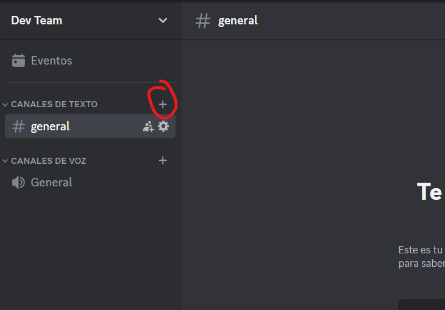
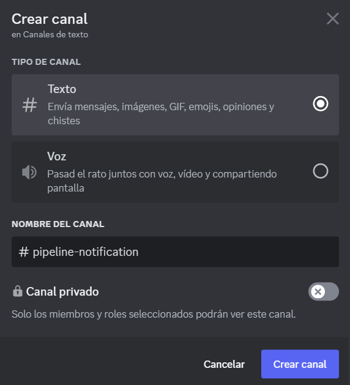
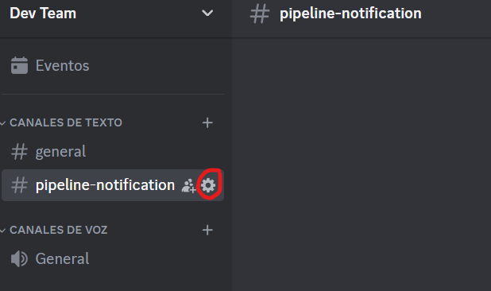
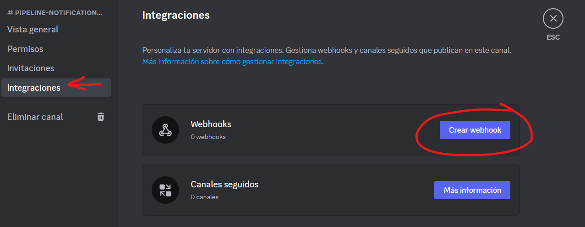
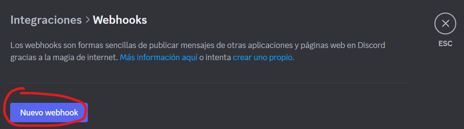
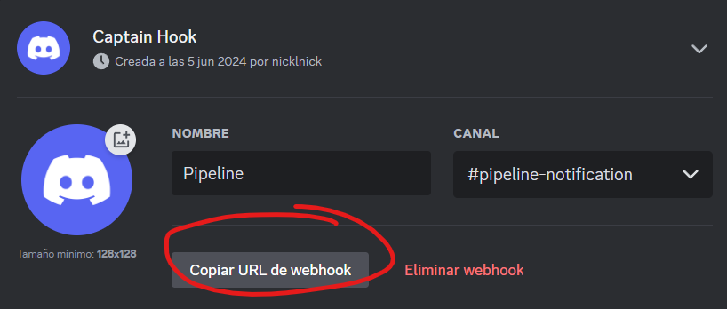
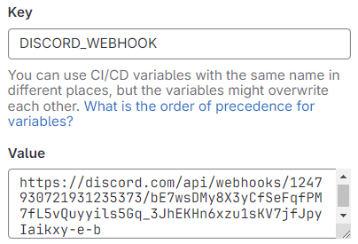
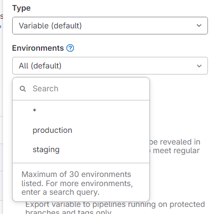

# 1. Creación de un pipeline en GitLab

A grandes rasgos, el proceso de despliegue denota los siguientes pasos:

1. Se realiza una operación de `git push` al repositorio, promoviendo una nueva versión del software
2. El pipeline del `runner` es ejecutado, realizando pruebas unitarias (u otros procesos) y a la empaquetación de una imagen de `Docker` correspondiente a la nueva versión del software como un servicio listo para desplegar
3. Esta imagen es subida a un registro privado de [GitLab Container Registry](https://docs.gitlab.com/ee/user/packages/container_registry/)
4. Se le envía a la instancia de producción la imagen generada y esta se levanta como servicio, concretando el despliegue y exponiendo la nueva versión del software al público.

Comenzaremos dando de alta un registro de contenedores dentro de nuestro repositorio con GitLab Container Registry.

> <u>Prerrequisitos</u>:
>
> -   Configurar Project Access Token en el repositorio ([link](./prerrequisitos/gitlab-pat.md))
> -   Tener un proyecto de Next.js en el repositorio ([link](nextjs-project.md))

Los pipelines en GitLab deben configurarse en un archivo `gitlab-ci.yml` en el directorio raíz de nuestro proyecto.

Un pipeline ejecuta una serie de stages, y dentro de cada stage podemos tener uno o más jobs. Los stages que tendremos en este ejemplo son:

-   **Preparation**: Involucra la preparación del ambiente de trabajo. Aquí definimos las versiones del software, obtenemos artefactos de otros repositorios, etc.
-   **Build**: Aquí definimos y generamos los artefactos utilizados en el resto de etapas. Podemos generar artefactos específicos para testing y otros específicos para producción.
-   **Testing**: Acá testeamos los artefactos que armamos en la etapa anterior.
-   **Notification**: Notificamos a los desarrolladores si los testeos pasaron o no, y si es necesario aprobación manual para la próxima etapa.
-   **Deploy**: Ponemos el código en alguno de los ambientes.

## 0. Setup

Lo primero que vamos a hacer es definir todos los stages que mencionamos en el tope del archivo `.gitlab-ci.yml`.

```yaml
stages:
    - prep
    - build
    - test
    - notification
    - deploy
```

## 1. Stage: Prep

Para el stage de _prep_ vamos a tener un único job que llamaremos "preparation", en el que vamos a querer generar un ID de nuestra build para que en un futuro podamos identificar las imágenes que estén pusheadas en el registry de containers.

```yaml
preparation:
    stage: prep
    script:
        - export BUILD_ID=$(date +%Y%m%d%H%M) # Generamos un id para la build
        - echo "BUILD_ID=${BUILD_ID}" > context.env # Lo guardamos en context.env
```

Notemos que estamos generando un archivo `context.env` que usaremos como artifact para poder pasar nuestras variables de entorno por los distintos jobs, por lo tanto tenemos que declararlo como tal.

```yaml
preparation:
  stage: prep
  script:
    - export BUILD_ID=$(date +%Y%m%d%H%M) # Generamos un id para la build
    - echo "BUILD_ID=${BUILD_ID}" > context.env # Lo guardamos en context.env
   artifacts:
      paths:
         - context.env
```

Además, queremos generar un nombre para la imagen de nuestra webapp. En este punto, es importante notar que como la vamos a pushear a GitLab debemos concatenarle el path absoluto a nuestro repositorio en esta plataforma. Para ellos, vamos a hacer uso de las [variables de CI/CD predefinidas en GitLab](https://docs.gitlab.com/ee/ci/variables/predefined_variables.html). Entonces, al comienzo del archivo `gitlab-ci.yml` agregamos lo siguiente:

```yaml
variables:
    IMAGE_BASE: "$CI_REGISTRY/$CI_PROJECT_NAMESPACE/$CI_PROJECT_NAME"
```

y dentro de el job de preparation ponemos:

```yaml
preparation:
    stage: prep
    script:
        - export BUILD_ID=$(date +%Y%m%d%H%M) # Generamos un id para la build
        - echo "BUILD_ID=${BUILD_ID}" > context.env # Lo guardamos en context.env

        - echo "APP_PROD_IMAGE_NAME=${IMAGE_BASE}/app:${CI_COMMIT_BRANCH}-${BUILD_ID}" >> context.env # Concatenamos a context.env el nombre de nuestra imagen de producción
```

Falta entonces poner la imagen default que se utilizará para ejecutar estos jobs. Para ello, vamos a agregar al tope del archivo lo siguiente:

```yml
image: docker:latest
```

Por lo tanto, al finalizar este punto deberíamos tener el `gitlab-ci.yml` como sigue:

```yaml
image: docker:latest

variables:
    IMAGE_BASE: "$CI_REGISTRY/$CI_PROJECT_NAMESPACE/$CI_PROJECT_NAME"

stages:
    - prep
    - build
    - test
    - notification
    - deploy

preparation:
    stage: prep
    script:
        - export BUILD_ID=$(date +%Y%m%d%H%M) # Generamos un id para la build
        - echo "BUILD_ID=${BUILD_ID}" > context.env # Lo guardamos en context.env

        - echo "APP_PROD_IMAGE_NAME=${IMAGE_BASE}/app:${CI_COMMIT_BRANCH}-${BUILD_ID}" >> context.env # Concatenamos a context.env el nombre de nuestra imagen de producción
    artifacts:
        paths:
            - context.env
```

## 2. Stage: Build

El stage de _build_ tendrá un único job "build". Este job trae consigo un inconveniente: la seguridad. La manera fácil de realizar el build de una imagen de Docker dentro de un container es otorgándole a este último privilegios de root, pero esto es poco seguro. Por ello vamos a optar por utilizar [Kaniko](https://github.com/GoogleContainerTools/kaniko), una imagen que hace el build de los contenedores sin necesitar los privilegios de _sudo_.

```yaml
build:
    stage: build
    image:
        name: "gcr.io/kaniko-project/executor:v1.14.0-debug"
        entrypoint: [""]
```

Notemos que debemos poner `entrypoint: [""]` porque de lo contrario vamos a ejecutar un comando que no queremos.

Hecho esto, vamos a querer utilizar Kaniko para _buildear_ y _pushear_ la imagen al registry de GitLab. Afortunadamente, Kaniko hace esto en un sólo paso, por lo que agregamos lo siguiente.

```yaml
build:
    stage: build
    image:
        name: "gcr.io/kaniko-project/executor:v1.14.0-debug"
        entrypoint: [""]
    script:
        - /kaniko/executor
          --context "${CI_PROJECT_DIR}"
          --dockerfile ${CI_PROJECT_DIR}/Dockerfile
          --destination $APP_PROD_IMAGE_NAME
```

Lo último que debemos hacer es obtener el artifact generado en el paso anterior, por lo que el yaml nos queda como sigue:

```yaml
build:
   stage: build
   image:
      name: "gcr.io/kaniko-project/executor:v1.14.0-debug"
      entrypoint: [""]
   script:
      - export $(cat context.env | xargs)

      - /kaniko/executor
         --context "${CI_PROJECT_DIR}" # Dónde esta el contexto para buildear la imagen
         --dockerfile ${CI_PROJECT_DIR}/Dockerfile # Dirección del Dockerfile que creamos en el paso #3
         --destination $APP_PROD_IMAGE_NAME  # A dónde dejamos la imagen de producción,
                                             # notemos que la dirección está en el mismo nombre de la imagen (${IMAGE_BASE}/<nombre>)
   needs:
      -  job: preparation
         artifacts: true
```

## 3. Stage: Test

El stage de _test_ contendrá dos jobs: "unit-test" y "uxui-test".

### Job: Unit-test

Este job se encargará (como dice su nombre) de realizar los tests unitarios de nuestro código. Para ello utilizaremos el framework de testing [Jest](https://jestjs.io/). La siguiente configuración de ejemplo está fuertemente inspirada en la que se puede encontrar en el siguiente [link](https://nextjs.org/docs/app/building-your-application/testing/jest).

1. Hacemos el set up de Jest _en nuestro proyecto_ (NO en el pipeline), para ello tenemos que instalarlo junto con unos paquetes como dependencias de dev. Esto debe ejecutarse desde el directorio raíz de nuestro proyecto de Next:

    ```bash
    npm install -D jest jest-environment-jsdom @testing-library/react @testing-library/jest-dom
    ```

2. En el directorio raíz de nuestro proyecto de Next debemos crear el archivo `jest.config.js` con el siguiente contenido:

    ```javascript
    const nextJest = require("next/jest");

    /** @type {import('jest').Config} */
    const createJestConfig = nextJest({
        // Provide the path to your Next.js app to load next.config.js and .env files in your test environment
        dir: "./",
    });

    // Add any custom config to be passed to Jest
    const config = {
        coverageProvider: "v8",
        testEnvironment: "jsdom",
        // Add more setup options before each test is run
        // setupFilesAfterEnv: ['<rootDir>/jest.setup.ts'],
    };

    // createJestConfig is exported this way to ensure that next/jest can load the Next.js config which is async
    module.exports = createJestConfig(config);
    ```

Este archivo configura Jest para que pueda trabajar correctamente con nuestra aplicación de Next.

3. En el `package.json` agregamos el comando `"test": "jest"` dentro de `"scripts"`.

4. En el pipeline, vamos a agregar el job de "unit-test" con el siguiente contenido:

    ```yaml
    unit-test:
        stage: test
        image: node:22-alpine3.18
        script:
            - npm ci
            - npm run test
    needs:
        - build
    ```

Teniendo configurado el pipeline para los tests unitarios, vamos a crear uno muy simple.

1. En la carpeta raíz del proyecto creamos la carpeta `__tests__/`.
2. Dentro de `__tests__/` creamos el archivo `page.test.tsx` con el siguiente contenido:

    ```tsx
    import "@testing-library/jest-dom";
    import { render, screen } from "@testing-library/react";
    import Page from "../src/app/page";

    describe("Page", () => {
        it("renders a heading", () => {
            render(<Page />);

            const heading = screen.getByRole("heading", { level: 1 });

            expect(heading).toBeInTheDocument();
        });
    });
    ```

### Job: Uxui-test

Este job se encargará de realizar los tests de usabilidad. Para ello utilizaremos el framework de testing [Cypress](https://www.cypress.io/). La siguiente configuración está fuertemente inspirada en el tutorial del siguiente [link](https://nextjs.org/docs/pages/building-your-application/testing/cypress).

1. En la carpeta raíz del proyecto ejecutamos el siguiente comando:

    ```bash
    npm install -D cypress
    ```

2. En el archivo `package.json`, dentro de la sección de `"scripts"` agregamos el siguiente comando: `"cypress:open": "cypress open"`.

3. Parados en la carpeta raíz de nuestro proyecto, corremos el comando `npm run cypress:open`. Esto nos dará a elegir entre **E2E Testing** y **Component Testing**. Nosotros elegiremos hacer **E2E Testing**.
   Esto nos creará un archivo `cypress.config.ts` y una carpeta `cypress/`. Chequear que el contenido de `cypress.config.ts` sea el siguiente:

    ```typescript
    import { defineConfig } from "cypress";

    export default defineConfig({
        viewportHeight: 1080,
        viewportWidth: 1920,
        video: true,
        screenshotOnRunFailure: true,
        e2e: {
            setupNodeEvents(on, config) {},
        },
    });
    ```

4. Desde la carpeta raíz de nuestro proyecto, corremos `npm install start-server-and-test`.

5. Para poder correr los tests en el pipeline debemos hacerlo en modo headless. Para ello, en el `package.json` dentro de la sección de `"scripts"` agregamos el siguiente comando: `"e2e:headless": "start-server-and-test dev http://localhost:3000 \"cypress run --e2e\""`.

6. En el `gitlab-ci.yml`, agregamos el job de uxui con el siguiente contenido:

    ```yaml
    uxui-test:
        stage: test
        image:
            name: "cypress/included:13.9.0"
            entrypoint: [""]
        script:
            - npm ci
            - npm run e2e:headless
        artifacts:
            name: failure-screenshots
            when: on_failure
            paths:
                - cypress/screenshots/
        needs:
            - build
    ```

Con esto habremos configurado correctamente los tests de usabilidad, ahora solo resta armarlos. Para ello haremos dos testeos muy simples.

1. Agregar/Modificar el archivo `src/app/page.tsx`:

    ```tsx
    import Link from "next/link";

    export default function Home() {
        return (
            <div>
                <h1>Home</h1>
                <Link href="/about">About</Link>
            </div>
        );
    }
    ```

2. Agregar el archivo `src/app/about/page.tsx`:

    ```tsx
    import Link from "next/link";

    const About = () => {
        return (
            <div>
                <h1>About</h1>
                <Link href="/">Home</Link>
            </div>
        );
    };

    export default About;
    ```

3. Agregamos un test para asegurarnos que la navegación esté funcionando correctamente. Para ello agregamos el archivo `cypress/e2e/app.cy.js`:

    ```javascript
    describe("Navigation", () => {
        it("should navigate to the about page", () => {
            // Start from the index page
            cy.visit("http://localhost:3000/");

            // Find a link with an href attribute containing "about" and click it
            cy.get('a[href*="about"]').click();

            // The new url should include "/about"
            cy.url().should("include", "/about");

            // The new page should contain an h1 with "About"
            cy.get("h1").contains("About");
        });
    });
    ```

## 4. Stage: Notification

> <u>Prerrequisito</u>:
>
> -   Tener un servidor de Discord

Para esta etapa buscamos notificar a los desarrolladores si los testeos fueron exitosos o no, y si es necesario realizar una aprobación manual para pasar a la próxima etapa. El stage de _notifiaction_ cuenta con dos jobs ("success_notification" y "failure_notification") para cada uno de los casos.
Para este ejemplo, se utilizará la plataforma de [Discord](https://discord.com/) para las notificaciones. Además, se realizó un fork de [este repositorio](https://github.com/DiscordHooks/gitlab-ci-discord-webhook) con el fin de agregar comportamiento adicional a las notificaciones.

Necesitamos crear y configurar una variable de entorno de GitLab con el webhook a nuestro servidor de Discord.

1. En Discord, tocamos en alguna categoría y creamos un canal de texto nuevo.  
   
2. Ponemos el nombre del canal y tocamos "Crear canal".  
   

3. Con el canal creado tocamos en la ruedita que aparece a la derecha.  
   

4. Tocamos en "Integraciones", y luego en "Crear webhook".  
   

5. Tocamos en "Nuevo webhook".  
   

6. Cambiamos el nombre del webhook y tocamos en "Copiar URL de webhook", este string será importante en el paso 9.  
   

7. Vamos nuestro repositorio de GitLab y tocamos en "Settings" > "CI/CD".

8. Clickeamos en Variables donde dice "Expand".

9. Tocamos "Add variable". En "Key" ponemos `DISCORD_WEBHOOK`, y en "Value" la URL que obtuvimos en el paso 6.  
   

10. Tocamos "Add variable".

Con esto finaliza la creación del webhook y el canal al que se enviarán las notificaciones. Pasaremos a configurar los dos jobs necesarios para esta etapa.

#### Job: success_notification

En nuestro `gitlab-ci.yml` agregamos el siguiente job:

```yaml
success_notification:
    image:
        name: mrnonz/alpine-git-curl:alpine3.16
        entrypoint: ["/bin/sh", "-c"]
    stage: notification
    script:
        - wget https://raw.githubusercontent.com/elianparedes/gitlab-ci-discord-webhook/master/send.sh
        - ls -al
        - chmod +x send.sh
        - sh send.sh --status waiting --webhook $DISCORD_WEBHOOK
    dependencies:
        - uxui-test
        - unit-test
    when: on_success
```

Notar que se está utilizando una imagen de [Alpine](https://alpinelinux.org/) con `curl` para que ocupe el menor espacio posible.

### Job: failure_notification

En nuestro `gitlab-ci.yml` agregamos el siguiente job:

```yaml
failure_notification:
    image:
        name: mrnonz/alpine-git-curl:alpine3.16
        entrypoint: ["/bin/sh", "-c"]
    stage: notification
    script:
        - wget https://raw.githubusercontent.com/elianparedes/gitlab-ci-discord-webhook/master/send.sh
        - chmod +x send.sh
        - latest_image=$(ls -t cypress/screenshots/**/*.png | head -n 1)
        - mv "$latest_image" failure_screenshot.png
        - sh send.sh --status failure --webhook $DISCORD_WEBHOOK --image failure_screenshot.png
    dependencies:
        - uxui-test
        - unit-test
    when: on_failure
```

Al igual que en el job anterior, se está utilizando una imagen de Alpine. Además, notar que se está obteniendo la imagen producida por Cypress del fallo de nuestro testeo, y luego es enviada en la notificación a los desarrolladores. Esto es parte del comportamiento adicional que se le agregó al repositorio original y busca dar un mensaje más detallado y preciso al equipo.

## 5. Stage: Deploy

El último stage de nuestro pipeline busca deployar nuestra aplicación en alguno de nuestros ambientes.

### 5.1. Creación de ambientes

Vamos a crear 2 ambientes: uno de producción y otro de staging. Para ello, debemos crear dos instancias EC2 adicionales a la que ya teníamos (`runner`). Vamos a hacer que `prod` sea nuestro server de producción, y `staging` el server de desarrollo.
Se pueden seguir los mismo pasos que en [esta guía](./prerrequisitos/ec2-runner.md#2-creación-de-instancias-ec2) para crear la instancias EC2. Notemos que podemos utilizar el mismo security group (`gitlab-sg`). Las ssh key pueden llamarse `staging_key.pem` (para `staging`) y `prod_key.pem` (para `production`).
Luego de crear las EC2, configuramos Docker en cada una de ellas(si no recordás como hacerlo mirá [esta guía](./prerrequisitos/ec2-docker.md)).

> [!IMPORTANT]
> Al terminar de configurar las EC2 con Docker, conectarse vía ssh a las instancias y ejecutar el siguiente comando: `sudo docker login registry.gitlab.com -u <gitlab_username> -p <pat>`. La creación de un `Project Access Token` se puede ver [aquí](./prerrequisitos/gitlab-pat.md).

### 5.2. Definición de variables y ambientes en GitLab

En primer lugar, creamos los ambientes en GitLab:

1. En nuestro repositorio vamos a "Operate" > "Environments".

2. Tocando en "New environment" creamos 2 environments: `production` y `staging` (probablemente ya esté creado el de `production`).

Luego, creamos las variables asociadas a estos ambientes:

1. Vamos a "Settings" > "CI/CD".

2. Tocamos en "Variables" > "Expand" > "Add variables".

3. Creamos la variable que contiene la ssh key para el ambiente de `production` (es análogo para `staging`):

    1. Ponemos que la variable es de tipo "File".
    2. En el campo "Environments" ponemos el de `production`.  
       
    3. En "Key" ponemos `SSH_KEY`.
    4. En "Value" ponemos el contenido de la key .pem de `production` que creamos anteriormente 

> [!IMPORTANT]
> Tal como indica la documentación de GitLab, es importante dejar una nueva línea al final del contenido colocado en el campo de "Value" de la ssh key.

4. Creamos la variable que contiene el dominio de la instancia EC2 de `production` (es análogo para `staging`):
    1. En el campo "Environments" ponemos el de `production`.
    2. En "Key" ponemos `SSH_HOST`
    3. En "Value" ponemos el dominio y usuario de nuestra instancia (ej. ubuntu@ec2-101-26-163-175.compute-1.amazonaws.com)

### 5.3. Creación de las branches

En nuestro proyecto de Git deberíamos crear una branch `staging` para que podamos usarla como ambiente de `staging`.

### 5.4. Creación del job de deployment

Finalmente, configuramos el job de deployment como sigue:

1. Dado que el proceso de deploy es análogo en ambos ambientes, podemos crear un template para que se ejecute solo cuando se pusheen cambios a la branch designada para ese ambiente.

    ```yaml
    .deploy_template: &deploy_configuration
        stage: deploy
        before_script:
            ##
            ## Instalar ssh-agent si no está ya instalado, es requerido por Docker.
            ## (cambia apt-get por yum si usas una imagen basada en RPM)
            ##
            - "command -v ssh-agent >/dev/null || ( apt-get update -y && apt-get install openssh-client -y )"

            ##
            ## Ejecutar ssh-agent (dentro del entorno de construcción)
            ##
            - eval $(ssh-agent -s)

            ##
            ## Dar los permisos correctos, de lo contrario ssh-add se negará a añadir archivos
            ## Añadir la clave SSH almacenada en la variable de tipo archivo SSH_PRIVATE_KEY del CI/CD al almacén del agente
            ##
            - chmod 400 "$SSH_KEY"
            - ssh-add "$SSH_KEY"

            ##
            ## Crear el directorio SSH y darle los permisos correctos
            ##
            - mkdir -p ~/.ssh
            - chmod 700 ~/.ssh
        script:
            - export $(cat context.env | xargs)

            ##
            ## Descargar la última imagen del registro
            ##
            - ssh -o StrictHostKeyChecking=no $SSH_HOST "docker pull ${APP_PROD_IMAGE_NAME}"

            ##
            ## Detener el contenedor en ejecución si existe
            ##
            - ssh -o StrictHostKeyChecking=no $SSH_HOST 'docker stop webapp || true'

            ##
            ## Eliminar el contenedor anterior si existe
            ##
            - ssh -o StrictHostKeyChecking=no $SSH_HOST 'docker rm webapp || true'

            ##
            ## Ejecutar el nuevo contenedor con la imagen más reciente
            ##
            - ssh -o StrictHostKeyChecking=no $SSH_HOST "docker run -d --name webapp -p 3000:3000 ${APP_PROD_IMAGE_NAME}"
        dependencies:
            - preparation
    ```

2. Ahora creamos el job que asocia la branch con el ambiente, y que hace uso del template.

    ```yaml
    deploy-prod:
        <<: *deploy_configuration
        only:
            - main
        environment:
            name: production
        when: manual

    deploy-staging:
        <<: *deploy_configuration
        only:
            - staging
        environment:
            name: staging
    ```

    Notemos que estamos pidiendo aprobación manual en el caso de que se trate de un deploy a producción.

# 2. Envío de mails

Si además de querer enviar notificaciones por Discord queremos enviarlas por mail podemos seguir lo que dice [esta guía](https://docs.gitlab.com/ee/user/project/integrations/pipeline_status_emails.html).

1. En el repositorio, tocar en "Settings" > "Integrations".
2. Seleccionar "Pipeline status emails".
3. Chequear que la checkbox "Active" esté seleccionada.
4. En "Recipients" poner una lista separada por comas de los mails de las personas que quieren recibir los mails.
5. Seleccionar las branches para las que se quieren las notificaciones.
6. Seleccionar "Save changes".

> [!NOTE]
> También es posible recibir notificaciones sólo para los pipelines rotos, para ello seleccionar la opción que dice "Notify only broken pipelines".
