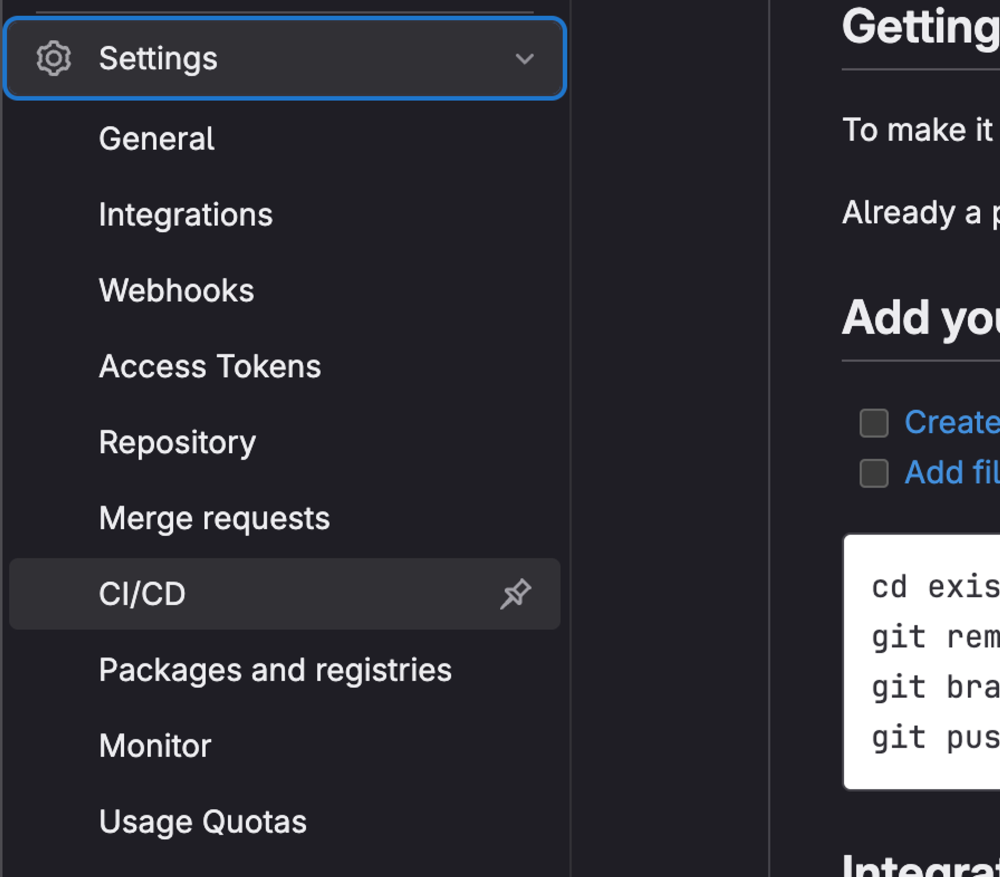
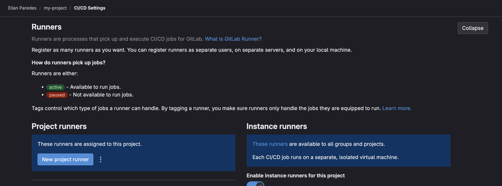
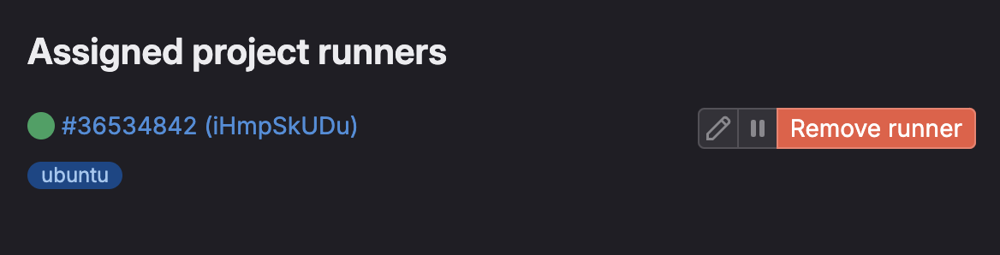
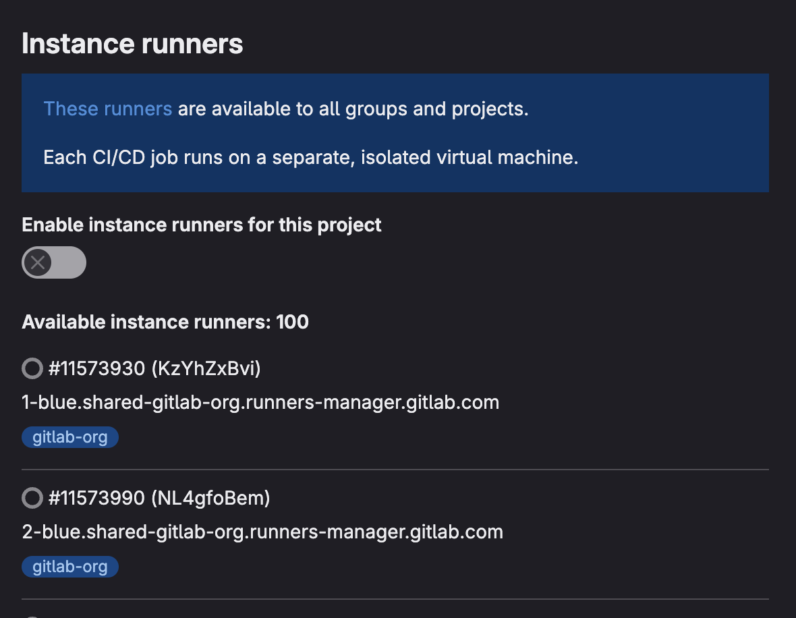

# Creación de GitLab Runner

A continuación se configurará un Runner de GitLab. Este se encargará de gestionar las peticiones de ejecución de un pipeline definido desde GitLab. La propia plataforma de GitLab nos guiará para configurar nuestra EC2 para que actúe como un Runner asociado a nuestro repositorio.

> <u>Prerrequisitos</u>:
>
> - Crear un repositorio de GitLab ([link](./prerrequisitos/gitlab-repo.md))
> - Tener una instancia EC2 ([link](./prerrequisitos/ec2-runner.md)) con Docker ([link](./prerrequisitos/ec2-docker.md)), y con estas características:
>   - _Sistema operativo_: Ubuntu Server 24.04 LTS con arquitectura x86
>   - _Tipo de instancia_: t2.medium
>   - _Par de claves_: ED25519

## 1. Creación del Runner

1. En la parte inferior izquierda de la página principal de nuestro repositorio GitLab tocamos "Settings" y accedemos a la sección de "CI/CD".
   

2. Expandimos la sección de "Runners" y tocamos en el botón de "New Project Runner"

   

3. Se nos pedirá ingresar un _tag_ para identificar el Runner. Podríamos colocar un tag como por ejemplo `ubuntu` para conocer rápidamente en qué sistema operativo se encuentra corriendo. A continuación clickeamos en "Create runner".

   

> [!IMPORTANT]
> Es importante marcar la opción `Run untagged jobs`, para que no sea necesario colocar un `tag` al querer correr un pipeline

4. Tocamos "Create Runner" y nos debería mandar a otra página de GitLab.

## 2. Registro del Runner

Esta siguiente etapa de configuración, consiste en la conexión y asociación de la instancia EC2 con la plataforma de GitLab para que esta actúe como Runner.

1. Nos conectamos a la instancia EC2 a través de SSH (si no sabés como hacerlo podés ver [este tutorial](./prerrequisitos/ec2-runner.md#3-conexión-a-una-instancia-ec2)).
2. Una vez dentro de la instancia EC2, comenzaremos con la instalación de GitLab Runner

   1. Descargamos el binario correspondiente para nuestro sistema. Dado que estamos en arquitectura de 64 bits (x86) ejecutamos:

      ```bash
      sudo curl -L --output /usr/local/bin/gitlab-runner https://gitlab-runner-downloads.s3.amazonaws.com/latest/binaries/gitlab-runner-linux-amd64
      ```

   2. Le damos permisos de ejecución:

      ```bash
      sudo chmod +x /usr/local/bin/gitlab-runner
      ```

   3. Creamos un usuario específico para GitLab Runner:

      ```bash
      sudo useradd --comment 'GitLab Runner' --create-home gitlab-runner --shell /bin/bash
      ```

   4. Hacemos la instalación de la aplicación e inicializamos el servicio:

      ```bash
      sudo gitlab-runner install --user=gitlab-runner --working-directory=/home/gitlab-runner
      sudo gitlab-runner start
      ```

3. Volviendo a GitLab, en el último paso de la [sección anterior](#1-creación-del-runner) fuimos redirigidos a una página en donde se muestran una serie de pasos a seguir.

   1. Copiamos el comando mostrado en el Step 1.
      ```bash
      sudo gitlab-runner register
          --url https://gitlab.com
          --token glrt-<TOKEN>
      ```
      
> [!IMPORTANT]
> El register los debemos correr este comando con `sudo`

   2. Daremos `Enter` en las primeras opciones hasta llegar a la selección del `executor`. Aquí seleccionaremos la opción `docker`.
   3. Ingresamos `docker:24.0.7` como imagen por defecto.
   4. Ejecutamos:
      ```bash
      gitlab-runner run
      ```

4. Finalmente deberíamos ver un mensaje en Gitlab que nos dice que el Runner se encuentra configurado y listo para asociarlo a un pipeline determinado.

   Al clickear en el botón de "View Runners", deberíamos ver el Runner configurado como activo:

   

5. A su vez, será importante desactivar los `Instance Runners` mediante el Switch “Enable instance runners for this project” ubicado en la parte lateral derecha del panel anterior, con el fin de usar exclusivamente el Runner recientemente configurado.
   

6. En la EC2, modificamos el archivo `/home/ubuntu/.gitlab-runner/config.toml` para que el campo `privileged` esté en `true`:

   ```bash

   [runners.docker]
       ...
       privileged = true
       ...
   ```

> [!NOTE]
> En el directorio `/home/ubuntu/.gitlab-runner/config.toml` se encuentra almacenada la configuración del GitLab Runner.
