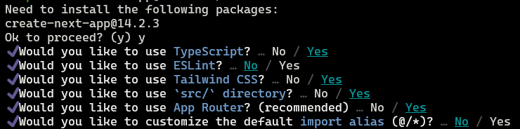
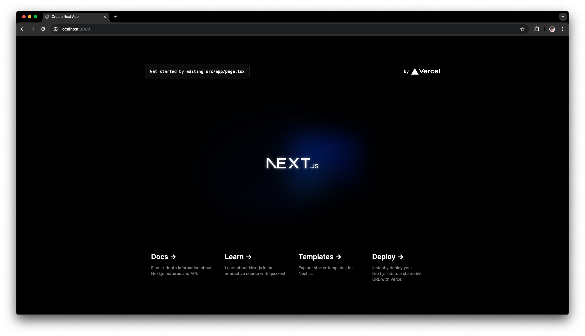

# Creación de proyecto de Next.js

En esta sección, crearemos un proyecto de Next.js para luego dockerizarlo y poder realizar los tests unitarios y e2e (UX/UI) en él.

## 1. Creación del proyecto de Next.js

1. En primer lugar es recomendable eliminar el archivo `README.md` autogenerado por GitLab, ya que este entrará en conflicto con la herramienta de generación de proyectos de Next.js. Para esto nos pararemos sobre el directorio raíz del proyecto y ejecutaremos:

    ```bash
    rm README.md
    ```

2. Inicializaremos el proyecto con el comando a continuación y eligiremos las distintas opciones por las que nos va llevando la CLI a elección.

    ```bash
    # Con "./" le indicamos generar el proyecto dentro de la misma carpeta en la cual
    # nos encontramos
    npx create-next-app@latest ./
    ```

    Nos van a empezar a salir distintas opciones, pero dejamos todo como viene predeterminado.

     

3. A continuación podremos probar la aplicación generada con el comando

    ```bash
    npm run dev
    ```

    Esto nos mostrará en la terminal un mensaje del estilo

    ```bash
    > my-project@0.1.0 dev
    > next dev

        ▲ Next.js 14.2.3
        - Local:        http://localhost:3000

        ✓ Starting...
        ✓ Ready in 1670ms
    ```

    Si accedemos al navegador en la URL `http://localhost:3000`, podremos observar la aplicación ejecutandose localmente.

    

## 2. Dockerizando la App de Next.js

Debemos definir un `Dockerfile` que describa cómo se debe empaquetar la aplicación de Next.js.

Dentro de la carpeta raíz del proyecto, crearemos un archivo Dockerfile , con el siguiente contenido:

```docker
# Usar la imagen oficial de Node.js como imagen base
FROM node:22-alpine3.18

# Establecer el directorio de trabajo en el contenedor
WORKDIR /usr/src/app

# Copiar package.json y package-lock.json al directorio de trabajo
COPY package*.json ./

# Instalar dependencias
RUN npm install

# Copiar el resto del código de la aplicación al directorio de trabajo
COPY . .

EXPOSE 3000

# Ejecutar el comando para iniciar la aplicación
CMD ["npm", "run", "dev"]
```

Una vez listo el archivo `Dockerfile`, lo subimos al repositorio y el mismo será consumido durante el pipeline en la etapa correspondiente.
