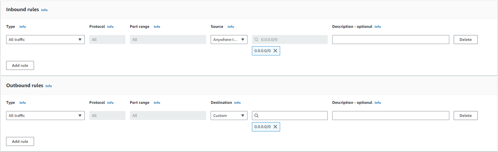
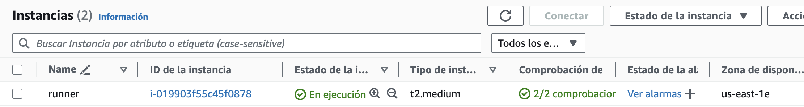
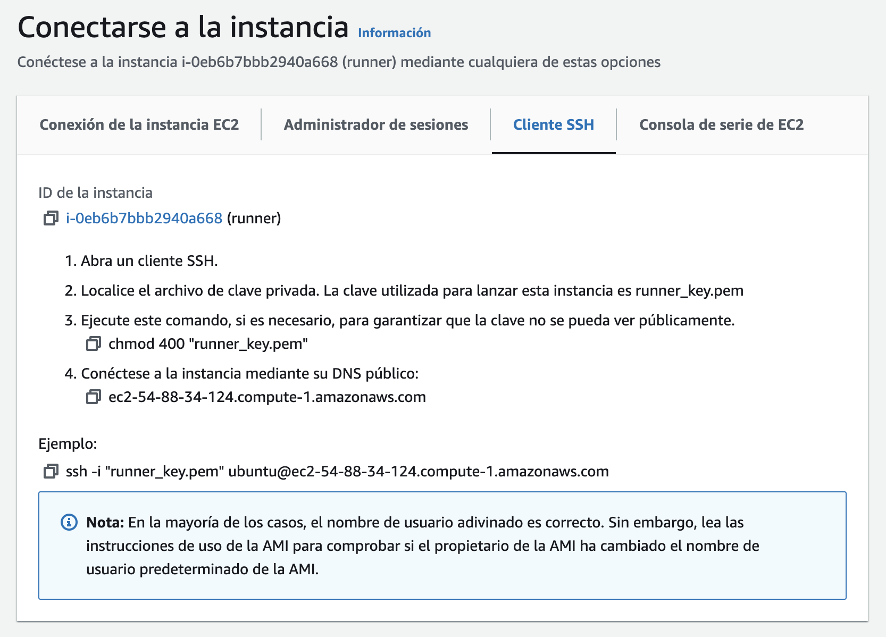

# Configuración de instancias EC2

Esta guía se centra en la creación de una instancia EC2 para correr nuestro GitLab Runner.

## 1. Creando un Security Group

Un Security Group es un conjunto de reglas de acceso “inbound” y “outbound”. Para configurar nuestras instancias EC2 vamos a necesitar un grupo de seguridad, por lo que primero debemos crearlo.

1.  Acceder al servicio de EC2 dentro de AWS.
2.  En el panel de la izquierda, buscar “Security groups” y clickear.
3.  En la parte superior derecha, clickear en “Create security group”.
4.  Ponerle un nombre al security group (en nuestro caso lo llamaremos `gitlab-sg`) y agregar una descripción (`gitlab-sg` o lo que sea).
5.  En “Inbound rules” y “Outbound rules” copiar la siguiente configuración.
    
6.  Clickear en el botón “Create security group” de la parte inferior derecha.

## 2. Creación de Instancias EC2

La instancia creada en este punto será la que luego utilizaremos como Runner de GitLab.

1. Acceder al servicio de EC2 dentro de AWS.
2. En el panel izquierdo clickear en "Instancias" > "Instancias"
3. En la parte superior derecha, clickear en “Lanzar Instancias”.
4. Ahora se configurará la instancia de la siguiente manera:

   1. Elegir un nombre característico para la instancia (en nuestro caso optamos por `Runner`, ya que estará destinada a trabajar como GitLab Runner).
   2. En la sección de “Sistemas operativos” y dentro de la pestaña de “Inicio rápido”, seleccionar Ubuntu y seleccionar `Ubuntu Server 24.04 LTS`. A continuación mantener una arquitectura de `64 bits (x86)`.

   3. Dentro de “Tipos de instancia” elegir `t2.medium`

   4. Debemos generar un par de claves de inicio de sesión, para esto se debe clickear en la opción “Crear un nuevo par de claves”. A continuación, introducir un nombre (sugerimos `runner_key`) y seleccionar `ED25519` como tipo de par de claves, y descargar el archivo con la clave privada.

      > [!IMPORTANT]
      > Es importante almacenar este archivo, pues será necesario para los próximos pasos de configuración.

   5. Seleccionar “Selecciona un grupo de seguridad existente”.
      1. Seleccionar `gitlab-sg` (el nombre que le pusimos en la [sección anterior](#1-creando-un-security-group)).
   6. Podemos dejar la configuración de almacenamiento como se encuentra por defecto.
   7. Lanzamos la instancia clickeando en la parte inferior derecha “Lanzar Instancia”

Una vez terminada la configuración de la instancia, se volverá a la pantalla principal del tablero de instancias de EC2, y se observará que la instancia creada ya se encuentra en ejecución.


> [!NOTE]
> La instancia puede tardar unos minutos en aparecer en ejecución.

## 3. Conexión a una instancia EC2

1. Clickeando en el `id de la instancia`, vamos a la parte superior
   derecha y tocamos en “Conectar”.
2. Seremos redirigidos a una pantalla que contiene los datos necesarios para conectarnos a la instancia EC2 mediante `ssh`. Es aquí, donde se vuelve importante el uso de la clave generada y el archivo `.pem` descargado en la [sección anterior](#2-creación-de-instancias-ec2).
   

   Para esto será necesario acceder a una terminal. Se recomienda pararse en el directorio que contiene el archivo `.pem` o, en su defecto, llevar el archivo `.pem` directamente a la carpeta `~/.ssh` y ejecutar los siguientes comandos.

3. En primer lugar se deberá conceder los permisos necesarios el archivo `.pem` . Para esto bastará con ejecutar:

   ```bash
   chmod 400 "runner_key.pem"
   ```

4. Luego se realizará la conexión SSH copiando el “Ejemplo” que aparece en la imagen del paso 2. En este caso:

   ```bash
   # Estando en el mismo directorio que el archivo .pem
   ssh -i "runner_key.pem" ubuntu@ec2-54-88-34-124.compute-1.amazonaws.com

   # O bien desde otro directorio y referenciando al mismo
   # e.g. suponiendo que el mismo se encuentra dentro de ~/.ssh
   ssh -i "~/.ssh/runner_key.pem" ubuntu@ec2-54-88-34-124.compute-1.amazonaws.com
   ```

   A continuación se nos consultará si deseamos continuar con la conexión, bastará con escribir `yes` y nos encontraremos dentro de la instancia EC2 mediante SSH.

## 4. Instalación de Docker en EC2

Si no sabés como instalar Docker en la instancia EC2 andá a [esta guía](./ec2-docker.md).
