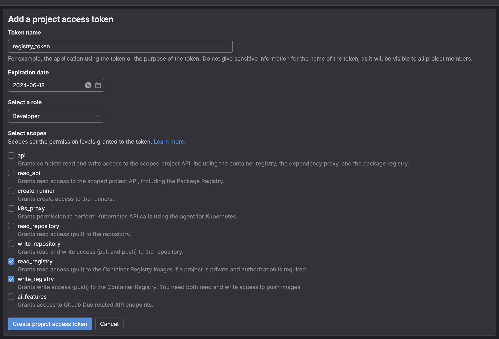

# Creación de Project Access Tokens

1. Dentro de nuestro repositorio, en la sección de "Settings", vamos a la opción de "Access Tokens".
2. A continuación clickearemos en "Add new token"
3. Aquí es importante colocarle un nombre descriptivo al token, en este caso `registry_token` , podemos asignarle una fecha de caducidad de forma opcional. También es fundamental seleccionar el rol de `Developer` y seleccionar los permisos de `read_registry` y `write_registry`.
   
4. Finalmente creamos el token.

> [!IMPORTANTE]
> Es importante copiar el token generado y guardarlo ya que lo necesitaremos en esta guía.

Con este token generado, vamos a poder subir y descargar imágenes desde el registro privado que GitLab nos ofrece durante el proceso de despliegue. Sin embargo para poder utilizar este token dentro del Pipeline, debemos crear una variable CI/CD correspondiente
