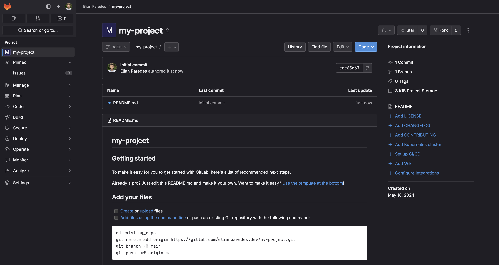

# Creación de repositorio en GitLab

Previo a construir el Pipeline de CI/CD, es necesario tener un repositorio en donde almacenar el código. Recordar que nuestro objetivo es ejecutar los Pipelines de manera automática a medida que se va subiendo el código. Aprovechando el ecosistema de GitLab, crearemos un repositorio desde su plataforma:

1. Ingresar a la plataforma de [GitLab](https://about.gitlab.com/) y clickear en “Sign In” ubicado en la parte superior derecha.
2. Crear una cuenta o iniciar sesión en caso de tener una.
3. Clickear en “New Project”.
4. Seleccionar la opción “Create Blank Project”.
5. Completar la información necesaria y crear el proyecto.
6. Finalmente se mostrará la pantalla principal del repositorio. En la misma se podrá observar información relevante:

   - En la parte central se encuentran los archivos junto al último _commit_ realizado por alguno de los colaboradores del repositorio.
   - En la parte izquierda, se encontrarán los distintos menús correspondientes a distintas configuraciones del repositorio. En esta guía se prestará mayor atención a las secciones de "Build", "Deploy" y "Settings".
     
